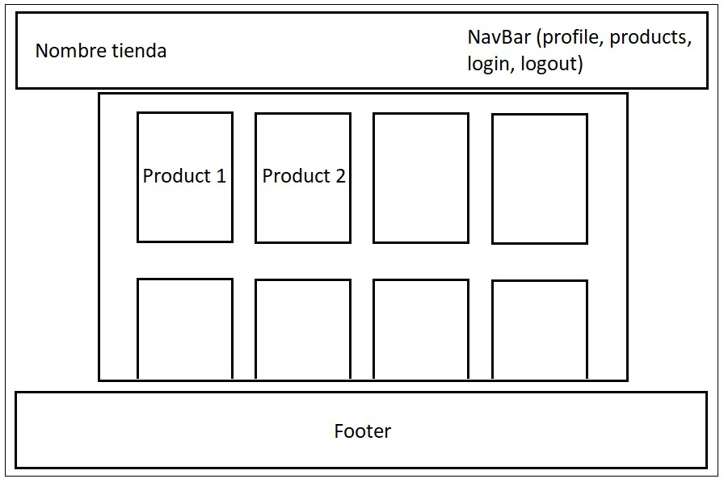

# PROYECTO 6: Aplicación Backend con Autenticación.

## Descripción

Este proyecto consiste en construir una aplicación `Fullstack` de `eCommerce` que uncluya todos los elementos esenciales para gestionar un negocio en línea con stack `MERN`.

Esto comprende los siguientes puntos:

- Un catálogo de productos que permita a los usuarios explorar los artículos disponibles.
- Un carrito de compras para que los usuarios puedan seleccionar y gestionar sus compras.
- Una pasarela de pago segura (específicamente Stripe, PayPal o MercadoPago, en versión de pruebas) que facilite las transacciones en línea.
- Autenticación de usuarios, incluido el registro de cuentas y el inicio de sesión, mediante JSON Web Tokens (JWT).
- Autorización, mediante la creación de áreas privadas en las que los usuarios puedan acceder y gestionar su perfil e información personal.

## Link en producción

Puede ir a la app en producción mediante el siguiente [LINK]() o realizar la instalación mediante el siguiente item.

## Prototipado simple de frontend



## Funcionamiento

La aplicación se inicia en la homepage, desde la cual de puede navegar en menus desde la navbar para acceder a un catalogo de productos, los cuales se pueden gestionar a gusto una vez se accede a algun perfil.

Es muy importante tener en cuenta que para la utilización de estas funcionalidades se debe crear un perfil nuevo en Register y llenar el fonrmulario.

Dentro de la app se puede actualizar datos del usuario en el menú Profile.

## Instalación y configuración

Para acceder a este proyecto, es necesario:

- Clonar este repositorio
- Acceder a esta carpeta a través de la terminal
- Realizar la instalación de dependencias para backend y client por la terminal con el siguiente comando:

```
$ npm install
```

- Asegúrate de tener un archivo `.env` con las variables de entorno con la siguiente estructura:

```
TOKEN_SECRET=<YOUR_SECTRET>
PORT=3000
MONGODB_URI=<MongoDBConnectionString>
STRIPE_SECRET_KEY=<STRIPE_PRIVATE_KET>
STRIPE_WH_SIGNING_SECRET=<STRIPE_WEBHOOK_SECRET>
```

- Ejecutar el proyecto con el `script` de `dev`

```
$ npm run dev
```
